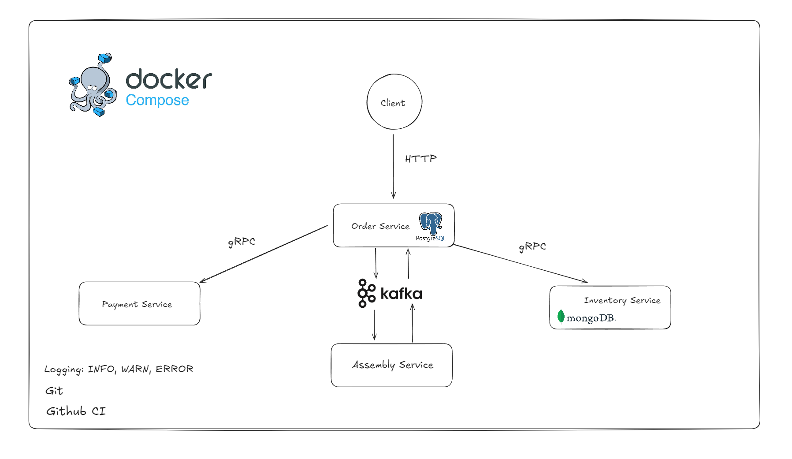

## Архитектура проекта


### Требования

- **Go** ≥ `1.24`
- **protoc** ≥ `3.21`
- **Buf CLI** (`task install-buf`) - для генерации protobuf
- **Node.js + npm** ≥ `18` - нужны только для сборки OpenAPI через **Redocly**
- Docker
- **Taskfile CLI** → [инструкция по установке](https://taskfile.dev/#/installation)

Проверить версию Taskfile:
```bash
task --version
```
---
## Быстрый старт
```
# Клонируем репозиторий
git clone https://github.com/yourusername/star-factory.git
cd star-factory

# Установка зависимостей
go work sync

# Поднимаем окружение в docker-compose
task up-all

# Запуск сервисов (намеренно не в compose, для удобства локально разработки)

# Order Service (HTTP: 8080)
cd order && go run ./cmd

# Inventory Service (gRPC: 50051, HTTP: 8081)
cd inventory && go run ./cmd

# Payment Service (gRPC: 50052, HTTP: 8082)
cd payment && go run ./cmd

# Assembly Service
cd assembly && go run ./cmd

# Запускаем тесты с подсчетом покрытия
task test-coverage
```
---
### Так же для Order, Inventory, Payment сервисов имеется OpenApi Swagger документация.

При старте сервисов по адресу (можно изменить в конфиге)

Inventory: localhost:8081

Payment: : localhost:8082

Order: если у вас IDE Goland => ./shared/api/order/v1/order.openapi.yaml можно открыть через неё

Если нет => ./shared/api/bundles/order.openapi.v1.bundle.yaml копируем содержимое, заходим на сайт https://editor.swagger.io/ и вставляем его туда


## CI/CD

Проект использует GitHub Actions для непрерывной интеграции и доставки. Основные workflow:

- **CI** (`.github/workflows/ci.yml`) - проверяет код при каждом push и pull request
  - Выполняется автоматическое извлечение версий из Taskfile.yml
  - Запуск линтера golangci-lint
  - Тестирование и подсчёт процента тестового покрытия
